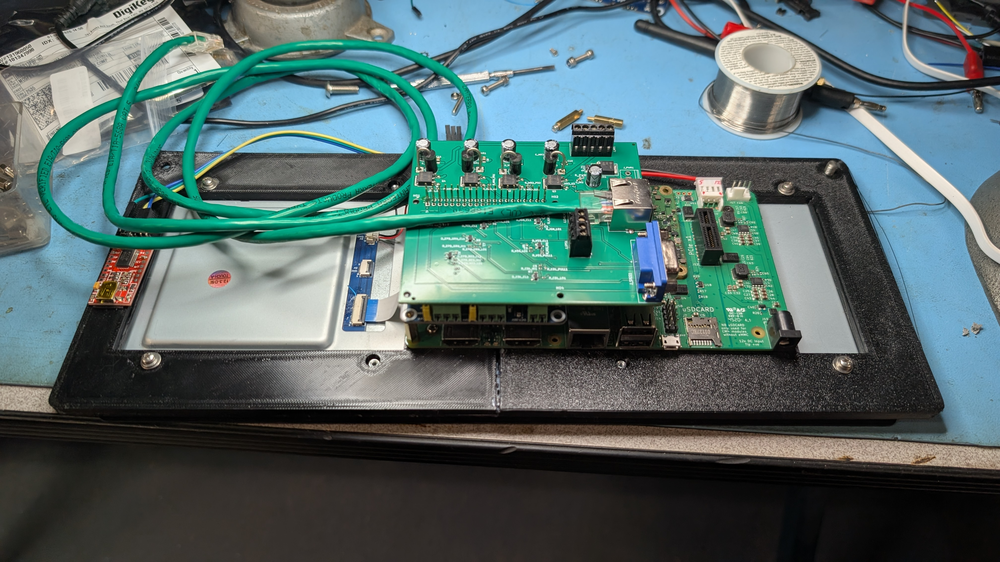

A HAT for a Raspberry Pi, in this case a CM4IO carrier with a RadXA CM3 module connected to a Waveshare 12.3 TOUCHA display, and a Waveshare dual CAN hat.  

Note:  The version pictured below has the RJ45 connector backwards.  This is fixed in the current version which has not been fabbed.

This board supports:

* RevUS Parking Brake controller status LED inputs.
* Up to 4 MagRide outputs for ride control (GM coils)
* GPS input
* Dual daisy-chained CAN (RJ-45)
* Center-Diff-Lock status input.
* HF2A Transfer case Lo-Range status input.
* HF2A transfer case VSS input.
* Dimmer status input (for day/night modes)

